# Isoformic: Isoform-level biological interpretation of transcriptomic data

## The Isoformic method

Welcome to `isoformic`, a workflow for isoform-level biological
interpretation of transcriptomic data.

### Information

All data used for the examples here were extracted from the paper:
[“Landscape of Dysregulated Placental RNA Editing Associated With
Preeclampsia”](https://pubmed.ncbi.nlm.nih.gov/32306769/) in which were
analyzed generated RNA-Seq datasets from preeclamptic and control
placentas. This dataset was chosen due for having many biological
replicates with high sequencing depth.

``` r
library(isoformic)
```

Load dependency packages

``` r
library(fs)
library(readr)
library(dplyr)
library(tidyr)
library(stringr)
library(ggplot2)
```

### Setting up the data

#### Initial Considerations

We highly recommend the use of
[Salmon](https://github.com/COMBINE-lab/salmon) for transcript-level
abundance estimation and the
[`swish`](https://bioconductor.org/packages/release/bioc/vignettes/fishpond/inst/doc/swish.html)
method implemented in the
[fishpond](https://bioconductor.org/packages/release/bioc/html/fishpond.html)
R package for isoform-level differential expression.

The [GENCODE](https://www.gencodegenes.org/human/) project offers a good
annotation of isoforms for the human and mouse genomes, including
isoforms of non-coding genes. Using other sources of annotation can
render completely different results for the following analysis.

#### Part 1: Data input

In this version you would need two essential input and two optional
inputs.

**Essential input 1:** A transcript differential expression table. This
table can be outputted from any kind of differential expression software
you use but it needs to contain 1) information on Transcript name OR
Ensembl Transcript ID per line 2) log2FoldChange information in a column
named “log2FoldChange”. 3) `p-value` information in a column named
“pvalue”. Any other columns on the table will not be used on the main
analysis. This DET table should be the UNFILTERED version of your table.

``` r
path_package("isoformic")
#> /home/runner/work/_temp/Library/isoformic
```

Example:

``` r
PE1_DETs <- read_csv(path_package("isoformic", "extdata", "DETs_fixed.csv"))
#> Rows: 72385 Columns: 4
#> ── Column specification ────────────────────────────────────────────────────────
#> Delimiter: ","
#> chr (1): transcript_id
#> dbl (3): log2FC, pvalue, qvalue
#> 
#> ℹ Use `spec()` to retrieve the full column specification for this data.
#> ℹ Specify the column types or set `show_col_types = FALSE` to quiet this message.
head(PE1_DETs)
#> # A tibble: 6 × 4
#>   transcript_id      log2FC  pvalue qvalue
#>   <chr>               <dbl>   <dbl>  <dbl>
#> 1 ENST00000456328.2 -0.692  0.0199  0.0940
#> 2 ENST00000488147.1  0.0731 0.652   0.812 
#> 3 ENST00000466430.5 -0.146  0.364   0.590 
#> 4 ENST00000442987.3 -0.183  0.0841  0.242 
#> 5 ENST00000494149.2 -0.728  0.00599 0.0420
#> 6 ENST00000595919.1 -0.0789 0.951   0.977
```

**Essential input 2:** a FASTA file from GENCODE which corresponds to
the same fasta you used for the transcriptome alignment. These need to
be on the same version since here you will use names from that GENCODE
version to do most of the mergings. The annotation used also need to be
GENCODE since it posses the `transcript_type` column that will be used
as information as well. If you wish you CAN provide that information
through and external source not being GENCODE, and from that you will
need a table with at least three columns: 1)a `transcript_name` column
that needs to match those gene names on your DET table and on your TPM
table, 2) a gene-name column to tell which gene those transcripts belong
to and 3) a transcript_type column.

This table will also have to use transcript names from GENCODE and have
a column stating the transcript biotype that is also got from GENCODE
annotation. The statistics can be ‘pvalue’, ‘svalue’ or ‘qvalue’ but a
‘log2FoldChange’ between your case and control conditions is also needed
for most of the plots.

**Optional inputs:** 1) A Transcript per million (TPM) table matching
the transcripts in the differential expression table 2) a GFF3 file of
the transcriptome version which corresponds to your FASTA and 3) a table
of differentially expressed genes of that data to also use as
comparison.

------------------------------------------------------------------------

Any differential expression table can be used here but the pipeline
authors, after multiple testing, reached the conclusion that the swish
implementation for a differential transcript expression analysis using
inferential replicate counts from Salmon is the one that performs the
best for medium to high depth transcriptome libraries when looking at
number of transcripts and significant values.

Not well annotated transcriptomes will not output results as these and
all the tests here mentioned were done using human data.

------------------------------------------------------------------------

Isoformic makes available example files that can be used as model for
formatting the necessary files for running the workflow. The files can
be found in the following path.

``` r
path_package("isoformic", "extdata")
#> /home/runner/work/_temp/Library/isoformic/extdata
```

And the files available can be seen with:

``` r
path_package("isoformic", "extdata") |>
  dir_ls()
#> /home/runner/work/_temp/Library/isoformic/extdata/DEGs_PE_fixed2.csv
#> /home/runner/work/_temp/Library/isoformic/extdata/DETs_fixed.csv
#> /home/runner/work/_temp/Library/isoformic/extdata/PE_1_DETs.csv
#> /home/runner/work/_temp/Library/isoformic/extdata/PE_1_counts.csv
#> /home/runner/work/_temp/Library/isoformic/extdata/c2.cp.reactome.v2023.1.Hs.symbols.gmt.txt
#> /home/runner/work/_temp/Library/isoformic/extdata/example_gencode.v34.annotation.parquet
#> /home/runner/work/_temp/Library/isoformic/extdata/hsapiens_REAC_subset.gmt
#> /home/runner/work/_temp/Library/isoformic/extdata/isoformic-logo.png
#> /home/runner/work/_temp/Library/isoformic/extdata/mini_inf_reps.rds
#> /home/runner/work/_temp/Library/isoformic/extdata/mini_quants
```

``` r
PE1_DETs <- path_package("isoformic", "extdata", "DETs_fixed.csv") |>
  read_csv()
PE1_DEGs <- path_package("isoformic", "extdata", "DEGs_PE_fixed2.csv") |>
  read_csv()
PE1_counts <- path_package("isoformic", "extdata", "PE_1_counts.csv") |>
  read_csv() |>
  dplyr::rename(transcript_id = `...1`)
```

Here we load the table which points for the libraries that represent our
cases (treatment) and our controls. In this library, cases are the
pregnant woman with Preeclampsia and controls matched pregnant without
Preeclampsia.

``` r
sample_table <- data.frame(
  samples = colnames(PE1_counts)[2:ncol(PE1_counts)],
  condition = c(rep("treatment", 8), rep("control", ncol(PE1_counts) - 9))
)
head(sample_table)
#>       samples condition
#> 1 SRR11498039 treatment
#> 2 SRR11498040 treatment
#> 3 SRR11498041 treatment
#> 4 SRR11498042 treatment
#> 5 SRR11498043 treatment
#> 6 SRR11498044 treatment
```

##### Download reference files

The references used for this project were obtained from the [GENCODE
Project](https://www.gencodegenes.org/human/) version 33 for the Human
genome annotation. The annotation file in GFF3 format was obtained from
\<’https://ftp.ebi.ac.uk/pub/databases/gencode/Gencode_human/release_33/gencode.v33.annotation.gff3.gz\>.

This step may take a while depending on the speed of your internet
connection.

``` r
gff_file_path <- download_reference(version = "33", file_type = "gff")
#> ✔ '/home/runner/.cache/R/isoformic/gencode.v33.chr_patch_hapl_scaff.annotation.gff3.gz'
#>   successfully downloaded.
# download_reference(version = "33", file_type = "fasta")
# download_reference(version = "33", file_type = "gtf")
```

To download mouse references, it is necessary to include the letter ‘M’
in the version string (e.g., “M37”).

------------------------------------------------------------------------

#### Part 2: Transcript to Gene and Gene to transcript reference tables

Using the FASTA file from GENCODE we will construct a transcript per
gene dictionary table and add that information to the main DEG, DET and
TPM table. This step will depend a lot on the names of the columns on
your tables so in the Vignette we decided to change names to keep
consistency.

The input used here is a FASTA file containing the transcript sequences
and their annotation information downloaded from the GENCODE website
with the specific version you used for the alignment. In the case here
GENCODE v33.

``` r
fasta_path <- download_reference(version = "33", file_type = "fasta")
read_lines(fasta_path, n_max = 5)
#> [1] ">ENST00000456328.2|ENSG00000223972.5|OTTHUMG00000000961.2|OTTHUMT00000362751.1|DDX11L1-202|DDX11L1|1657|processed_transcript|"
#> [2] "GTTAACTTGCCGTCAGCCTTTTCTTTGACCTCTTCTTTCTGTTCATGTGTATTTGCTGTC"                                                                 
#> [3] "TCTTAGCCCAGACTTCCCGTGTCCTTTCCACCGGGCCTTTGAGAGGTCACAGGGTCTTGA"                                                                 
#> [4] "TGCTGTGGTCTTCATCTGCAGGTGTCTGACTTCCAGCAACTGCTGGCCTGTGCCAGGGTG"                                                                 
#> [5] "CAAGCTGAGCACTGGAGTGGAGTTTTCCTGTGGAGAGGAGCCATGCCTAGAGTGGGATGG"
```

As that header shows the imported table is still very weird and not
tidy, so we pass it through the `make_tx_to_gene` function that will
make it tidy and ready for further use.

``` r
tx_to_gene <- make_tx_to_gene(
  file_path = fasta_path,
  file_type = "fasta"
)
head(tx_to_gene)
#> # A tibble: 6 × 8
#>   transcript_id    gene_id havanna_gene_id havanna_transcript_id transcript_name
#>   <chr>            <chr>   <chr>           <chr>                 <chr>          
#> 1 ENST00000456328… ENSG00… OTTHUMG0000000… OTTHUMT00000362751.1  DDX11L1-202    
#> 2 ENST00000450305… ENSG00… OTTHUMG0000000… OTTHUMT00000002844.2  DDX11L1-201    
#> 3 ENST00000488147… ENSG00… OTTHUMG0000000… OTTHUMT00000002839.1  WASH7P-201     
#> 4 ENST00000619216… ENSG00… -               -                     MIR6859-1-201  
#> 5 ENST00000473358… ENSG00… OTTHUMG0000000… OTTHUMT00000002840.1  MIR1302-2HG-202
#> 6 ENST00000469289… ENSG00… OTTHUMG0000000… OTTHUMT00000002841.2  MIR1302-2HG-201
#> # ℹ 3 more variables: gene_name <chr>, tx_length <chr>, transcript_type <chr>
```

Now our `tx_to_gene` table has 6 columns that are in order: Ensembl
transcript id, Ensembl gene id, Havanna gene id, Havanna transcript id,
transcript name, gene name, transcript length and transcript type. For
the DEG, DET and TPM table we will need the Ensembl gene id, the Gene
name and the transcript type information so we can convert our tables
for transcript_name and add the type information and if the gene is a DE
to the DET table.

Select the columns with the gene id and the gene name info

``` r
tx_to_gene <- tx_to_gene |>
  dplyr::select(
    transcript_id, gene_id,
    transcript_name, gene_name,
    transcript_type
  )
head(tx_to_gene)
#> # A tibble: 6 × 5
#>   transcript_id     gene_id           transcript_name gene_name  transcript_type
#>   <chr>             <chr>             <chr>           <chr>      <chr>          
#> 1 ENST00000456328.2 ENSG00000223972.5 DDX11L1-202     DDX11L1    processed_tran…
#> 2 ENST00000450305.2 ENSG00000223972.5 DDX11L1-201     DDX11L1    transcribed_un…
#> 3 ENST00000488147.1 ENSG00000227232.5 WASH7P-201      WASH7P     unprocessed_ps…
#> 4 ENST00000619216.1 ENSG00000278267.1 MIR6859-1-201   MIR6859-1  miRNA          
#> 5 ENST00000473358.1 ENSG00000243485.5 MIR1302-2HG-202 MIR1302-2… lncRNA         
#> 6 ENST00000469289.1 ENSG00000243485.5 MIR1302-2HG-201 MIR1302-2… lncRNA
```

First we add the `gene_name` information to the DEG table

``` r
gene_join <- tx_to_gene |>
  dplyr::select(gene_id, gene_name) |>
  distinct()
PE1_DEGs <- PE1_DEGs |>
  left_join(gene_join, by = "gene_id") |>
  dplyr::relocate("gene_name", .after = "gene_id")
```

Now the transcript name for the TPM table

``` r
tpm_join <- tx_to_gene |>
  dplyr::select(transcript_id, transcript_name) |>
  distinct()
PE1_counts <- PE1_counts |>
  left_join(tpm_join, by = c("transcript_id")) |>
  dplyr::relocate("transcript_name", .after = "transcript_id")
```

The DET table will be our main table for analysis.

------------------------------------------------------------------------

#### Part 3: Constructing the main table

The Gene-level information will input for us categorical values to be
added on the DET table. In more detail: we need to now if that
transcript’s gene (1) pass on the gene-level expression cutoff values
and (2) which type does that transcript belongs to.

There are multiple types on the Ensembl library and some of their
definitions superpose to one another, the ones further analyzed here can
be seen on this figure

``` r
knitr::include_graphics("https://i.imgur.com/UWoAr0k.png")
```


First we add the transcript name and type information to the DET table

``` r
transcript_joined <- tx_to_gene |>
  dplyr::select(transcript_id, transcript_name, transcript_type) |>
  dplyr::distinct()
PE1_DETs <- PE1_DETs |>
  dplyr::left_join(transcript_joined, by = "transcript_id") |>
  dplyr::relocate("transcript_name", "transcript_type", .after = "transcript_id")
```

For the gene expression level we have to convert the DEG table and do
some cutting to get the genes which present as DE and exclude possible
noise. Here we used the cutoffs of absolute log2FC higher than one and
pvalue lower than 0.05

So we first filter the DEG table for the significant ones and the add it
as a column on our main DET table using the isDEGsig function.

``` r
PE1_DEGs_new_names_sig <- PE1_DEGs |>
  filter(abs(log2FC) >= 1) |>
  filter(pvalue <= 0.05) |>
  dplyr::select(gene_name) |>
  tidyr::drop_na()
DEGs_sig_joined <- PE1_DEGs_new_names_sig |>
  left_join(tx_to_gene, by = "gene_name")
transcript_gene_join <- tx_to_gene |>
  dplyr::select(transcript_name, gene_name) |>
  dplyr::distinct()
```

``` r
PE1_DETs_final <- is_deg_sig(DEGs_sig_joined$transcript_name, PE1_DETs)
PE1_DETs_final <- PE1_DETs_final |>
  left_join(transcript_gene_join, by = "transcript_name")
```

And now we have all the tables we will need for all graphs and analyses.

One detail is that the DET final table now allows us to see genes whose
transcripts are differentially expressed but their genes are not with a
simple dplyr filter.

``` r
DETs_not_DEGs <- PE1_DETs_final |>
  filter(pvalue < 0.05, abs(log2FC) > 1, DEG_sig == "NO")

DETs_not_DEGs |>
  dplyr::arrange(qvalue)
#> # A tibble: 3,882 × 8
#>    transcript_id  transcript_name transcript_type log2FC  pvalue  qvalue DEG_sig
#>    <chr>          <chr>           <chr>            <dbl>   <dbl>   <dbl> <chr>  
#>  1 ENST000004691… PLA2G2A-204     processed_tran…  -3.24 1.38e-7 2.36e-5 NO     
#>  2 ENST000003155… CDC42-201       protein_coding    2.33 1.38e-7 2.36e-5 NO     
#>  3 ENST000003743… NIPAL3-204      protein_coding   -1.21 1.38e-7 2.36e-5 NO     
#>  4 ENST000004809… TMEM50A-203     processed_tran…   1.67 1.38e-7 2.36e-5 NO     
#>  5 ENST000004738… MAN1C1-204      processed_tran…   1.18 1.38e-7 2.36e-5 NO     
#>  6 ENST000004965… MAN1C1-207      processed_tran…   1.49 1.38e-7 2.36e-5 NO     
#>  7 ENST000004557… STMN1-206       protein_coding    1.01 1.38e-7 2.36e-5 NO     
#>  8 ENST000003742… STMN1-202       protein_coding   -2.75 1.38e-7 2.36e-5 NO     
#>  9 ENST000003599… PTPRF-201       protein_coding    1.81 1.38e-7 2.36e-5 NO     
#> 10 ENST000004641… NASP-207        retained_intron   1.60 1.38e-7 2.36e-5 NO     
#> # ℹ 3,872 more rows
#> # ℹ 1 more variable: gene_name <chr>

PE1_DETs_final |>
  dplyr::arrange(qvalue) |>
  dplyr::arrange(-abs(log2FC)) |>
  # dplyr::slice_head(n = 30) |>
  dplyr::filter(stringr::str_detect(transcript_name, "^EGFR")) |>
  print(n = 30)
#> # A tibble: 8 × 8
#>   transcript_id   transcript_name transcript_type log2FC  pvalue  qvalue DEG_sig
#>   <chr>           <chr>           <chr>            <dbl>   <dbl>   <dbl> <chr>  
#> 1 ENST0000063846… EGFR-211        protein_coding   8.57  2.26e-2 1.02e-1 NO     
#> 2 ENST0000042031… EGFR-204        protein_coding   1.72  2.76e-7 3.20e-5 NO     
#> 3 ENST0000045508… EGFR-207        protein_coding   1.34  4.06e-4 6.49e-3 NO     
#> 4 ENST0000044241… EGFR-AS1-201    lncRNA           1.14  1.26e-4 2.85e-3 YES    
#> 5 ENST0000048550… EGFR-210        retained_intron  1.09  3.90e-5 1.25e-3 NO     
#> 6 ENST0000034457… EGFR-203        protein_coding   0.969 2.76e-6 1.84e-4 NO     
#> 7 ENST0000027549… EGFR-201        protein_coding   0.424 1.02e-2 5.99e-2 NO     
#> 8 ENST0000045968… EGFR-208        processed_tran…  0.421 3.44e-2 1.35e-1 NO     
#> # ℹ 1 more variable: gene_name <chr>
```

This table will represent cases which could be characterized as isoform
switches, when two transcripts of the same gene are expressed in
opposite directions what makes the total expression of that gene not be
significant either up or down-regulated.

## Colors

Before we start plotting we will define a general set of colors to be
used through the entire pipeline associated with a certain type of
transcript. Here we colored all the most abundant types separately and
the less abundant on the same grey tone and name that vector accordingly

``` r
tx_biotypes <- c(
  "gene", "protein_coding",
  "retained_intron", "protein_coding_CDS_not_defined",
  "nonsense_mediated_decay", "lncRNA",
  "processed_pseudogene", "transcribed_unprocessed_pseudogene",
  "unprocessed_pseudogene", "non_stop_decay",
  "transcribed_unitary_pseudogene", "pseudogene",
  "unitary_pseudogene", "processed_transcript"
)

tx_biotype_color_names <- c(
  "#fb8072", "#a6d854",
  "#8da0cb", "#fc8d62",
  "#66c2a5", "#e78ac3",
  "#ffd92f", "#e5c494",
  "#d9d9d9", "#d9d9d9",
  "#d9d9d9", "#ffffb3",
  "#d9d9d9", "#d9d9d9"
)

names(tx_biotype_color_names) <- tx_biotypes

tx_biotype_color_names
```

``` r
print(tx_type_palette())
#>                               gene                     protein_coding 
#>                          "#fb8072"                          "#a6d854" 
#>                    retained_intron     protein_coding_CDS_not_defined 
#>                          "#8da0cb"                          "#fc8d62" 
#>            nonsense_mediated_decay                             lncRNA 
#>                          "#66c2a5"                          "#e78ac3" 
#>               processed_pseudogene transcribed_unprocessed_pseudogene 
#>                          "#ffd92f"                          "#e5c494" 
#>             unprocessed_pseudogene                     non_stop_decay 
#>                          "#d9d9d9"                          "#d9d9d9" 
#>     transcribed_unitary_pseudogene                         pseudogene 
#>                          "#d9d9d9"                          "#ffffb3" 
#>                 unitary_pseudogene               processed_transcript 
#>                          "#d9d9d9"                          "#d9d9d9"
```

## Log2FC Plot

The simplest and first plot on this tutorial will be a log2FC plot, this
plot will compare the foldchange of case vs control from the gene, to
that of its transcripts adding to that the significance information.

For that we will make a combined version of the DEG table with the DET
table using the function join_DEG_DET.

``` r
DEG_DET_table <- join_DEG_DET(PE1_DEGs, PE1_DETs_final, logfc_cut = 1, pval_cut = 0.05)

head(DEG_DET_table)
#> # A tibble: 6 × 9
#>   feature_id         feature_name  log2FC pvalue qvalue feature_type gene_name
#>   <chr>              <chr>          <dbl>  <dbl>  <dbl> <chr>        <chr>    
#> 1 ENSG00000000003.15 TSPAN6       -0.320  0.0485  0.125 gene         TSPAN6   
#> 2 ENSG00000000005.6  TNMD          0.381  0.107   0.222 gene         TNMD     
#> 3 ENSG00000000419.12 DPM1         -0.0693 0.260   0.417 gene         DPM1     
#> 4 ENSG00000000457.14 SCYL3         0.107  0.386   0.547 gene         SCYL3    
#> 5 ENSG00000000460.17 C1orf112      0.162  0.229   0.380 gene         C1orf112 
#> 6 ENSG00000000938.13 FGR          -0.162  0.160   0.296 gene         FGR      
#> # ℹ 2 more variables: significance <chr>, is_de <chr>
```

Now you just use the `plotLog2FC` for any gene you would like. The
function also works well with a small vector of `gene_names`.

``` r
# selected_gene = "RBPJ"
plot_log2FC(DEG_DET_table, "RBPJ")
```

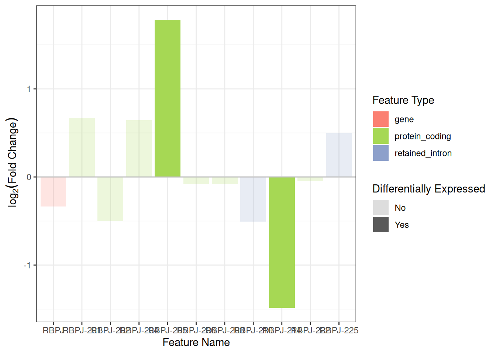

``` r
# Work here to look better? or just remove for now
# the best would be a loop that goes over each one of a list and
# plots them in a folder the default could be the DET not deg table
plot_obj <- plot_log2FC(DEG_DET_table, c("RBPJ", "EGFR", "PNCK"))

plot_obj +
  theme_classic() +
  theme(axis.text.x = element_text(angle = 45, vjust = 1, hjust = 1))
```

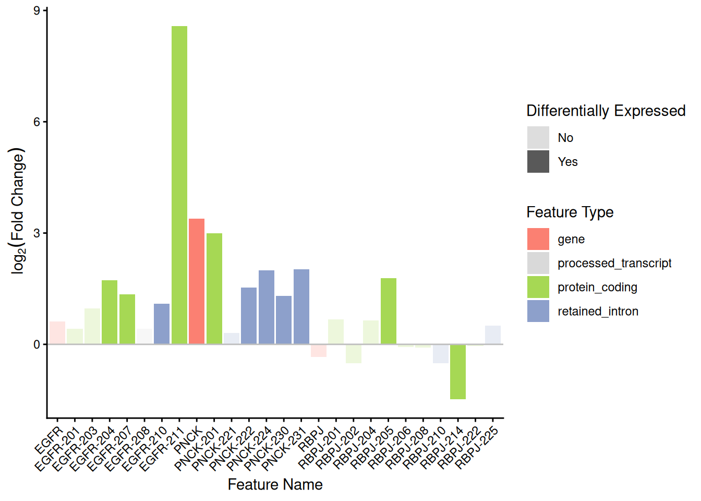

Multiple panels.

``` r
c("RBPJ", "EGFR", "PNCK") |>
  purrr::map(function(gene) {
    DEG_DET_table |>
      plot_log2FC(gene) +
      ggplot2::theme_classic() +
      ggplot2::theme(axis.text.x = ggplot2::element_text(angle = 45, vjust = 1, hjust = 1)) +
      ggplot2::ggtitle(gene)
  }) |>
  patchwork::wrap_plots(ncol = 1, guides = "collect")
```

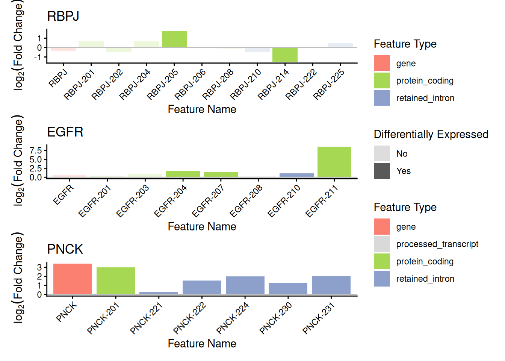

## Profile Plot

Another good more quantifiable way to visualize this switch is using the
Transcript per Million Count of each transcript, compared to those of
the gene between the case and control conditions. For this we use a
profile plot that in one size plots the values of TPM for the case
conditions and in the other the value of the TPM for the control
conditions.

``` r
profile_data_df <- prepare_profile_data(
  txi_transcript = PE1_counts,
  tx_to_gene = tx_to_gene,
  sample_metadata = sample_table,
  de_result_gene = PE1_DEGs,
  de_result_transcript = PE1_DETs,
  var = "condition",
  var_levels = c("control", "treatment")
)

profile_plot <- plot_tx_expr(
  genes_to_plot = "RBPJ",
  profile_data = profile_data_df
)
profile_plot
```

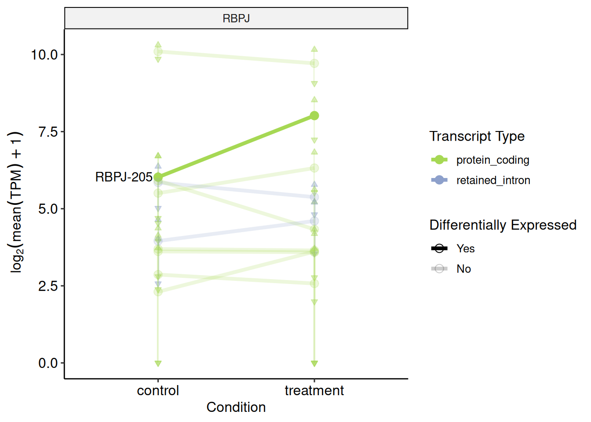

``` r
head(profile_data_df)
#> # A tibble: 6 × 7
#>   genename condition mean_TPM      SD transcript_type DE    parent_gene
#>   <chr>    <fct>        <dbl>   <dbl> <chr>           <fct> <chr>      
#> 1 A1BG     control      11.7     4.53 gene            No    genename   
#> 2 A1BG     treatment     9.60    4.80 gene            No    genename   
#> 3 A1BG-AS1 control       7.28    4.20 gene            No    genename   
#> 4 A1BG-AS1 treatment     5.80    4.17 gene            No    genename   
#> 5 A2M      control    6342.   1870.   gene            No    genename   
#> 6 A2M      treatment  5995.   1411.   gene            No    genename
```

``` r
profile_data_df |>
  filter(genename %in% "IL2RA")
#> # A tibble: 2 × 7
#>   genename condition mean_TPM    SD transcript_type DE    parent_gene
#>   <chr>    <fct>        <dbl> <dbl> <chr>           <fct> <chr>      
#> 1 IL2RA    control       32.5 14.5  gene            Yes   genename   
#> 2 IL2RA    treatment     11.8  9.04 gene            Yes   genename

profile_plot <- plot_tx_expr(
  genes_to_plot = "IL2RA",
  profile_data = profile_data_df
)
profile_plot
```

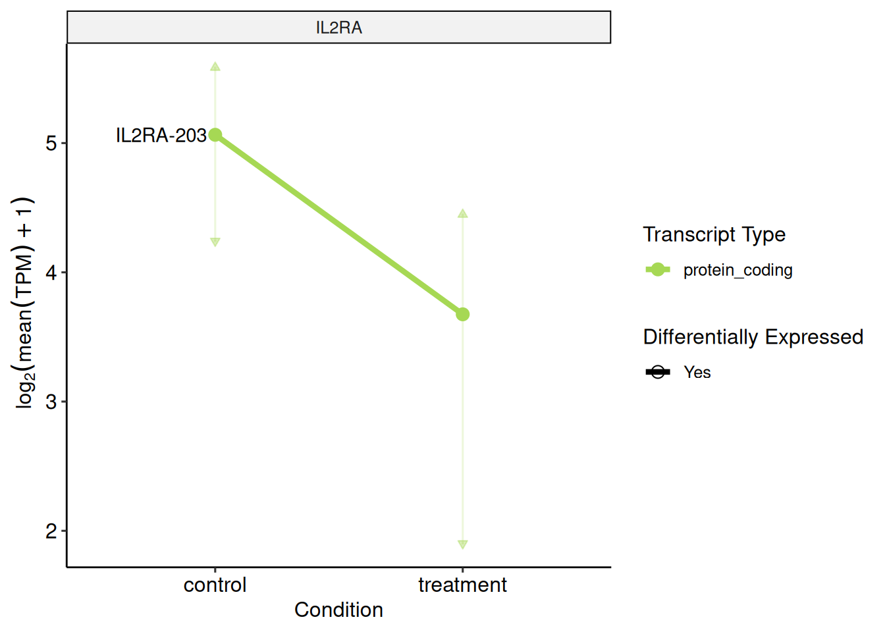

``` r
profile_data_df |>
  filter(genename %in% "EGFR")
#> # A tibble: 2 × 7
#>   genename condition mean_TPM    SD transcript_type DE    parent_gene
#>   <chr>    <fct>        <dbl> <dbl> <chr>           <fct> <chr>      
#> 1 EGFR     control      3255.  774. gene            No    genename   
#> 2 EGFR     treatment    4963. 2439. gene            No    genename

profile_plot <- plot_tx_expr(
  genes_to_plot = "EGFR",
  profile_data = profile_data_df
)
profile_plot
```

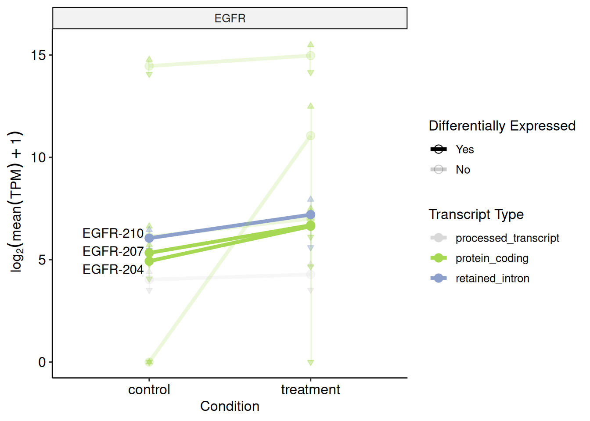

## Functional Transcript Enrichment

One of the biggest caveats for transcript level analysis is that in many
times is hard to extract biologically relevant information from so much
data. Instead of having a final table with 900 genes you get a table
with over 3.000 transcripts after the differential expression cut. The
next step for gene-level DE would be functional enrichment or assigning
the genes to metabolic pathways those may be regulating. Unfortunately
are no comprehensive datasets for pathways transcripts may be regulating
and the gene level analyses normally loses the difference between those
transcripts which can produce proteins (protein_coding) from canonical
translation pathways and those which cannot. To solve this problem we
developed a method of expanding the known .gmts for transcript
information and then separately enrich each selected category of
transcript. Between the alternative spliced isoforms of that do not code
for canonical proteins the most abundant are those classified as
*Nonsense-mediated decay*, that have a premature stop codon which is
subject to targeted degradation and the *Protein coding CDS not defined*
(formerly identified as “processed transcript”), which, for any reason,
do not possess a complete Open Reading Frame. Inside the processed
transcript category the one with the highest count are the *Retained
introns*, sequences which retain an intronic portion after their
processing.

These three categories are the most abundant in those transcripts which
arise from the alternative splicing of a protein coding gene and these
three will be the main focus for our enrichment and further graphs.

So first we choose a .gmt to be used for the enrichment, in this case we
loaded a human reactome gene list from MSigDB called c2. But any gene
list in [GMT format](https://docs.gsea-msigdb.org/#GSEA/Data_Formats/)
works here. The gmt is loaded on the fgsea format with lists for each
biological process.

``` r
fs::path_package("isoformic", "extdata", "c2.cp.reactome.v2023.1.Hs.symbols.gmt.txt")
#> /home/runner/work/_temp/Library/isoformic/extdata/c2.cp.reactome.v2023.1.Hs.symbols.gmt.txt

genesets_list <- fgsea::gmtPathways(
  gmt.file = fs::path_package("isoformic", "extdata", "c2.cp.reactome.v2023.1.Hs.symbols.gmt.txt")
)

head(str(genesets_list[1:5]))
#> List of 5
#>  $ REACTOME_INTERLEUKIN_6_SIGNALING        : chr [1:11] "JAK2" "TYK2" "CBL" "STAT1" ...
#>  $ REACTOME_APOPTOSIS                      : chr [1:179] "BAD" "CFLAR" "PSMB1" "PSMC4" ...
#>  $ REACTOME_HEMOSTASIS                     : chr [1:678] "FGR" "CD99" "TFPI" "KDM1A" ...
#>  $ REACTOME_INTRINSIC_PATHWAY_FOR_APOPTOSIS: chr [1:55] "BAD" "BID" "BAK1" "CASP8" ...
#>  $ REACTOME_MAPK3_ERK1_ACTIVATION          : chr [1:10] "JAK2" "MAPK3" "TYK2" "IL6ST" ...
#> NULL
head(genesets_list[[1]])
#> [1] "JAK2"  "TYK2"  "CBL"   "STAT1" "IL6ST" "IL6"
```

Visualize how is our table before running

``` r
head(PE1_DETs_final)
#> # A tibble: 6 × 8
#>   transcript_id   transcript_name transcript_type log2FC  pvalue  qvalue DEG_sig
#>   <chr>           <chr>           <chr>            <dbl>   <dbl>   <dbl> <chr>  
#> 1 ENST0000064952… ISG15-203       protein_coding   0.640 3.11e-1 5.40e-1 YES    
#> 2 ENST0000037937… AGRN-201        protein_coding   0.534 1.29e-2 7.07e-2 YES    
#> 3 ENST0000046111… AGRN-202        retained_intron -0.530 5.81e-2 1.91e-1 YES    
#> 4 ENST0000045346… RNF223-201      protein_coding   1.83  1.66e-5 6.81e-4 YES    
#> 5 ENST0000049786… TNFRSF4-203     retained_intron  0.415 2.20e-1 4.40e-1 YES    
#> 6 ENST0000037923… TNFRSF4-201     protein_coding   0.374 2.27e-1 4.48e-1 YES    
#> # ℹ 1 more variable: gene_name <chr>
```

Then you run the
[`run_enrichment()`](https://luciorq.github.io/isoformic/reference/run_enrichment.md)
function it needs your DETs final table, the gene set list and a p-value
cutoff to be used. It will generate a table of enrichment but with an
extra column “experiment”.

``` r
enrichment_df <- run_enrichment(
  det_df = PE1_DETs_final,
  genesets_list = genesets_list,
  tx_to_gene = tx_to_gene,
  pval_cutoff = 0.05
)
head(enrichment_df)
#>                                                         pathway         pval
#>                                                          <char>        <num>
#> 1:              REACTOME_ABC_FAMILY_PROTEINS_MEDIATED_TRANSPORT 0.0020462055
#> 2:                           REACTOME_ABC_TRANSPORTER_DISORDERS 0.0093847179
#> 3: REACTOME_ACROSOME_REACTION_AND_SPERM_OOCYTE_MEMBRANE_BINDING 0.0388416861
#> 4:                REACTOME_ACTIVATED_NTRK2_SIGNALS_THROUGH_PI3K 0.0005364371
#> 5:                 REACTOME_ACTIVATED_NTRK2_SIGNALS_THROUGH_RAS 0.0113517662
#> 6:                REACTOME_ACTIVATED_NTRK3_SIGNALS_THROUGH_PI3K 0.0163050214
#>          padj   log2err        ES      NES  size
#>         <num>     <num>     <num>    <num> <int>
#> 1: 0.04390041 0.4317077 0.3765654 1.460352   266
#> 2: 0.10002293 0.3807304 0.3668388 1.389022   199
#> 3: 0.23504200 0.3217759 0.7791037 1.524748     6
#> 4: 0.02288467 0.4772708 0.7290547 1.850483    19
#> 5: 0.11258009 0.3807304 0.6017850 1.633391    26
#> 6: 0.13467948 0.3524879 0.7330355 1.612455    10
#>                                                        leadingEdge
#>                                                             <list>
#> 1:     OS9-209,PSMD7-204,PSMA5-206,UBC-205,ABCB1-201,UBA52-201,...
#> 2:    OS9-209,PSMD7-204,PSMA5-206,UBC-205,UBA52-201,ERLIN2-206,...
#> 3:                                 CD9-208,CD9-216,CD9-212,CD9-204
#> 4: NTRK2-208,PIK3R1-202,PIK3R1-216,NTRK2-204,NTF4-203,GAB1-201,...
#> 5:                  NTRK2-208,NTRK2-204,NTF4-203,NTF4-201,SHC1-208
#> 6: PIK3R1-202,PIK3R1-216,PIK3R1-201,PIK3CA-205,IRS1-201,PIK3R1-211
#>        experiment
#>            <char>
#> 1: protein_coding
#> 2: protein_coding
#> 3: protein_coding
#> 4: protein_coding
#> 5: protein_coding
#> 6: protein_coding

head(names(genesets_list))
#> [1] "REACTOME_INTERLEUKIN_6_SIGNALING"                                                           
#> [2] "REACTOME_APOPTOSIS"                                                                         
#> [3] "REACTOME_HEMOSTASIS"                                                                        
#> [4] "REACTOME_INTRINSIC_PATHWAY_FOR_APOPTOSIS"                                                   
#> [5] "REACTOME_MAPK3_ERK1_ACTIVATION"                                                             
#> [6] "REACTOME_TRANSLESION_SYNTHESIS_BY_Y_FAMILY_DNA_POLYMERASES_BYPASSES_LESIONS_ON_DNA_TEMPLATE"

unique(enrichment_df$experiment)
#> [1] "protein_coding"          "unproductive"           
#> [3] "retained_intron"         "processed_transcript"   
#> [5] "nonsense_mediated_decay"
```

This experiment column has five possible values: Protein-coding: which
is the enrichment associated with the transcripts categorized as protein
coding. Unproductive: This is a term that will be used moving forward to
combine those three categories of alternative spliced isoforms
transcribed by coding genes. The authors are aware that biologically
this term is deprecated since those kind of transcripts can produce
peptides from alternative translation pathways. So here unproductive
should be read as virtually incapable of producing the protein that is
associated with that gene. As interpretation, we made this category to
find pathways which are not being regulated on our coding data, but by
the unproductive transcripts.

We also added three categories which are the individual alternative
spliced types and the pathways regulated by those for specific analysis.
In a very deep transcriptome the individual enrichment from those
categories can also lead to promising insights.

Plotting the enrichment

We used a LollipopPlot to plot all the enrichments side by side with the
size of each pathway as the radius of the circles and the transparency
is if that pathway passes on the desired cutoff. First we plot for only
Protein_coding versus Unproductive with a very extringent NES cutoff.

``` r
enrichment_df |>
  dplyr::filter(
    experiment %in% c("protein_coding", "unproductive") & abs(NES) >= 2
  ) |>
  dplyr::arrange(padj) |>
  dplyr::slice_head(n = 30) |>
  ggplot2::ggplot(ggplot2::aes(pathway, experiment)) +
  ggplot2::geom_point(ggplot2::aes(col = NES, size = size)) +
  ggplot2::coord_flip() +
  ggplot2::theme_minimal() +
  viridis::scale_color_viridis(option = "mako", direction = -1)
```

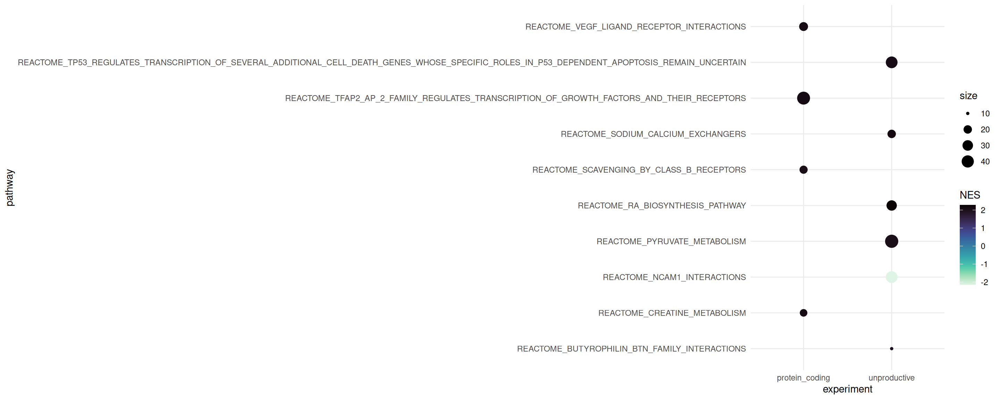

And now the specific unproductive subtypes

``` r
enrichment_df |>
  dplyr::filter(!experiment %in% c("protein_coding", "unproductive") & abs(NES) > 1.5) |>
  dplyr::arrange(padj) |>
  dplyr::slice_head(n = 20) |>
  ggplot2::ggplot(ggplot2::aes(pathway, experiment)) +
  ggplot2::geom_point(ggplot2::aes(col = NES, size = size)) +
  ggplot2::coord_flip() +
  ggplot2::theme_minimal() +
  viridis::scale_color_viridis(option = "magma", direction = -1)
```

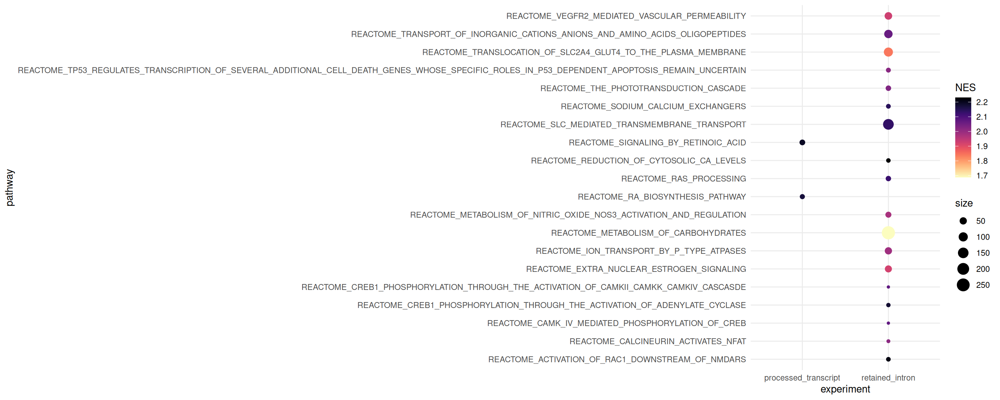

## Genomic Context Plot

One of the main issues we arrived at the start of the isoform level
analysis, was that there was no easy direct way to visualize
transcript-types if compared one to another, and using the
transcript-type and the transcript per million information.

Most of the alignment plots today use the outputs from .bam/.sam files
that align directly to the genome making us lose the transcript-type
information and increasing considerably the processing time for any
analysis for the size of the files and the time it takes to re-align.

To solve this problem we used a more direct approach which allows us to
visualize the difference of introns and exons between the transcript,
the types of those transcripts and how much they were counted according
to the pseudo-alignment; but in turn it loses the read alignment count
proportion. This alignment count unfortunately requires running
alignment softwares and dealing with .sam and .bam files which will not
be covered on this tutorial. We called this plot the genomic context
plot and it takes inspiration from the way Ensembl shows it transcripts
on their genome browser.

This specific plot requires a GFF file that can also be downloaded from
GENCODE to be included in the file path on next function. This GFF file
needs to be downloaded on the accurate version for your transcriptome,
in this case v33.

``` r
gff_file <- download_reference(version = "33", file_type = "gff")
#> ℹ '/home/runner/.cache/R/isoformic/gencode.v33.chr_patch_hapl_scaff.annotation.gff3.gz'
#>   already exists.

context_data <- create_context_data(
  gff_file = gff_file,
  organism = "Homo sapiens",
  orgdb_package = "org.Hs.eg.db",
  bsgenome_package = "BSgenome.Hsapiens.NCBI.GRCh38"
)
#> Import genomic features from the file as a GRanges object ... OK
#> Prepare the 'metadata' data frame ... OK
#> Make the TxDb object ...
#> Warning in .get_cds_IDX(mcols0$type, mcols0$phase): The "phase" metadata column contains non-NA values for features of type
#>   stop_codon. This information was ignored.
#> Warning in .extract_transcripts_from_GRanges(tx_IDX, gr, mcols0$type, mcols0$ID, : the transcript names ("tx_name" column in the TxDb object) imported from the
#>   "transcript_id" attribute are not unique
#> Warning in .makeTxDb_normarg_chrominfo(chrominfo): genome version information
#> is not available for this TxDb object
#> OK
```

Plotting the context of the FLT1 isoforms.

``` r
plot_genomic_context(
  gene_name = "FLT1",
  context_data = context_data
)
#> 
#> Warning in .set_group_names(grl, use.names, txdb, by): some group names are NAs
#> or duplicated
#> text[text1]
#> ideogram[ideogram1]
#> highlight[highlight1]
#> zoom[zoom1]
#> genomeLabel[genomeLabel1]
#> transcripts[transcripts1]
```

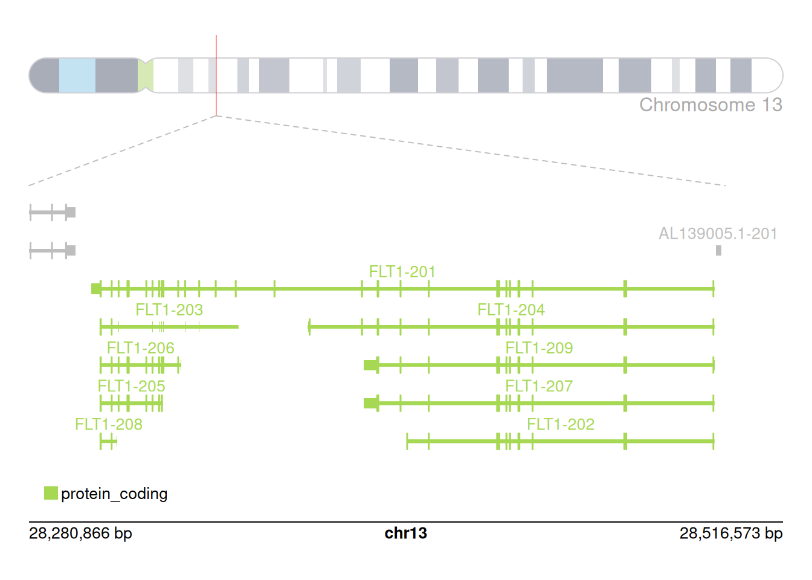

    #> legend[legend1]

#### Protein coding example

``` r
plot_genomic_context(
  gene_name = "EGFR",
  context_data = context_data,
  y_offset = 4.5,
  height_offset = 1
)
#> Warning in .set_group_names(grl, use.names, txdb, by): some group names are NAs
#> or duplicated
#> text[text1]
#> ideogram[ideogram1]
#> highlight[highlight1]
#> zoom[zoom1]
#> genomeLabel[genomeLabel1]
#> transcripts[transcripts1]
```

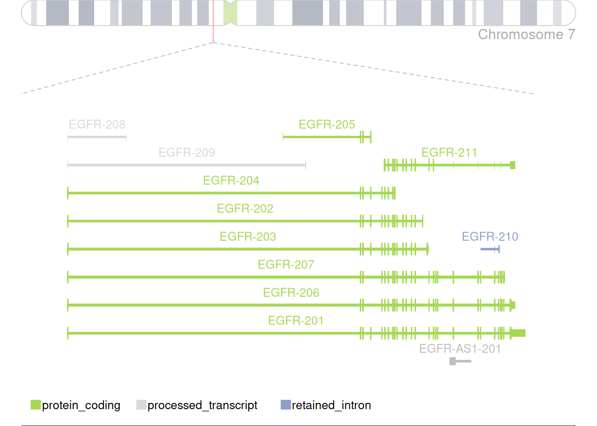

    #> legend[legend1]

Expanding the context around the genomic region of interest.

``` r
plot_genomic_context(
  gene_name = "XIST",
  context_data = context_data,
  y_offset = 0,
  height_offset = 1.5,
  upstream_offset = 100000
)
#> Warning in .set_group_names(grl, use.names, txdb, by): some group names are NAs
#> or duplicated
#> text[text1]
#> ideogram[ideogram1]
#> highlight[highlight1]
#> zoom[zoom1]
#> genomeLabel[genomeLabel1]
#> Warning: Not enough plotting space for all provided elements. ('+' indicates
#> elements not shown.)
#> transcripts[transcripts1]
```

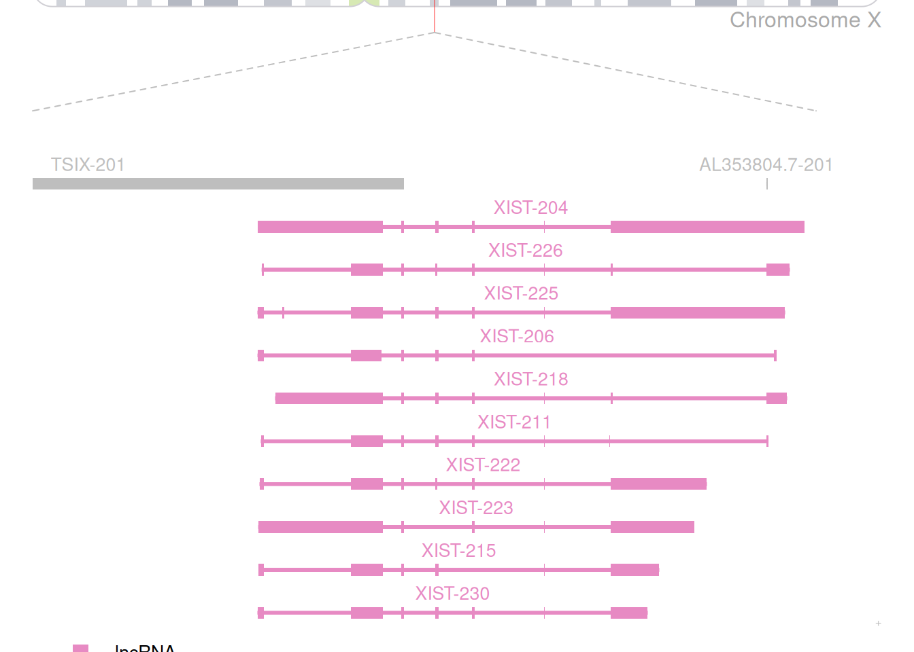

    #> legend[legend1]

``` r
plot_genomic_context(
  gene_name = "TSIX",
  context_data = context_data,
  y_offset = 0,
  height_offset = 0.5,
  downstream_offset = 100000
)
#> Warning in .set_group_names(grl, use.names, txdb, by): some group names are NAs
#> or duplicated
#> text[text1]
#> ideogram[ideogram1]
#> highlight[highlight1]
#> zoom[zoom1]
#> genomeLabel[genomeLabel1]
#> Warning: Not enough plotting space for all provided elements. ('+' indicates
#> elements not shown.)
#> transcripts[transcripts1]
```

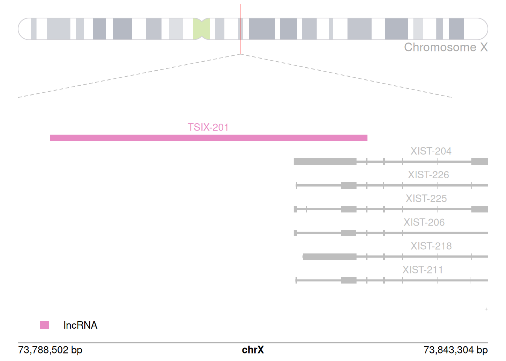

    #> legend[legend1]

### Session Information

``` r
sessionInfo()
#> R version 4.5.2 (2025-10-31)
#> Platform: x86_64-pc-linux-gnu
#> Running under: Ubuntu 24.04.3 LTS
#> 
#> Matrix products: default
#> BLAS:   /usr/lib/x86_64-linux-gnu/openblas-pthread/libblas.so.3 
#> LAPACK: /usr/lib/x86_64-linux-gnu/openblas-pthread/libopenblasp-r0.3.26.so;  LAPACK version 3.12.0
#> 
#> locale:
#>  [1] LC_CTYPE=C.UTF-8       LC_NUMERIC=C           LC_TIME=C.UTF-8       
#>  [4] LC_COLLATE=C.UTF-8     LC_MONETARY=C.UTF-8    LC_MESSAGES=C.UTF-8   
#>  [7] LC_PAPER=C.UTF-8       LC_NAME=C              LC_ADDRESS=C          
#> [10] LC_TELEPHONE=C         LC_MEASUREMENT=C.UTF-8 LC_IDENTIFICATION=C   
#> 
#> time zone: UTC
#> tzcode source: system (glibc)
#> 
#> attached base packages:
#> [1] stats4    stats     graphics  grDevices utils     datasets  methods  
#> [8] base     
#> 
#> other attached packages:
#>  [1] GenomicRanges_1.62.0 Seqinfo_1.0.0        IRanges_2.44.0      
#>  [4] S4Vectors_0.48.0     BiocGenerics_0.56.0  generics_0.1.4      
#>  [7] ggplot2_4.0.0        stringr_1.6.0        tidyr_1.3.1         
#> [10] dplyr_1.1.4          readr_2.1.5          fs_1.6.6            
#> [13] isoformic_0.1.2.9017
#> 
#> loaded via a namespace (and not attached):
#>   [1] strawr_0.0.92                           
#>   [2] RColorBrewer_1.1-3                      
#>   [3] jsonlite_2.0.0                          
#>   [4] magrittr_2.0.4                          
#>   [5] GenomicFeatures_1.62.0                  
#>   [6] farver_2.1.2                            
#>   [7] rmarkdown_2.30                          
#>   [8] BiocIO_1.20.0                           
#>   [9] vctrs_0.6.5                             
#>  [10] memoise_2.0.1                           
#>  [11] Rsamtools_2.26.0                        
#>  [12] RCurl_1.98-1.17                         
#>  [13] rstatix_0.7.3                           
#>  [14] htmltools_0.5.8.1                       
#>  [15] S4Arrays_1.10.0                         
#>  [16] progress_1.2.3                          
#>  [17] AnnotationHub_4.0.0                     
#>  [18] curl_7.0.0                              
#>  [19] broom_1.0.10                            
#>  [20] Rhdf5lib_1.32.0                         
#>  [21] SparseArray_1.10.1                      
#>  [22] Formula_1.2-5                           
#>  [23] rhdf5_2.54.0                            
#>  [24] gridGraphics_0.5-1                      
#>  [25] httr2_1.2.1                             
#>  [26] cachem_1.1.0                            
#>  [27] GenomicAlignments_1.46.0                
#>  [28] lifecycle_1.0.4                         
#>  [29] pkgconfig_2.0.3                         
#>  [30] Matrix_1.7-4                            
#>  [31] R6_2.6.1                                
#>  [32] fastmap_1.2.0                           
#>  [33] GenomeInfoDbData_1.2.15                 
#>  [34] MatrixGenerics_1.22.0                   
#>  [35] digest_0.6.37                           
#>  [36] patchwork_1.3.2                         
#>  [37] AnnotationDbi_1.72.0                    
#>  [38] RSQLite_2.4.4                           
#>  [39] org.Hs.eg.db_3.22.0                     
#>  [40] ggpubr_0.6.2                            
#>  [41] filelock_1.0.3                          
#>  [42] labeling_0.4.3                          
#>  [43] httr_1.4.7                              
#>  [44] abind_1.4-8                             
#>  [45] compiler_4.5.2                          
#>  [46] bit64_4.6.0-1                           
#>  [47] withr_3.0.2                             
#>  [48] S7_0.2.0                                
#>  [49] backports_1.5.0                         
#>  [50] BiocParallel_1.44.0                     
#>  [51] carData_3.0-5                           
#>  [52] viridis_0.6.5                           
#>  [53] DBI_1.2.3                               
#>  [54] ggsignif_0.6.4                          
#>  [55] biomaRt_2.66.0                          
#>  [56] rappdirs_0.3.3                          
#>  [57] DelayedArray_0.36.0                     
#>  [58] rjson_0.2.23                            
#>  [59] tools_4.5.2                             
#>  [60] glue_1.8.0                              
#>  [61] restfulr_0.0.16                         
#>  [62] rhdf5filters_1.22.0                     
#>  [63] grid_4.5.2                              
#>  [64] fgsea_1.36.0                            
#>  [65] gtable_0.3.6                            
#>  [66] tzdb_0.5.0                              
#>  [67] data.table_1.17.8                       
#>  [68] hms_1.1.4                               
#>  [69] car_3.1-3                               
#>  [70] utf8_1.2.6                              
#>  [71] XVector_0.50.0                          
#>  [72] BiocVersion_3.22.0                      
#>  [73] ggrepel_0.9.6                           
#>  [74] pillar_1.11.1                           
#>  [75] yulab.utils_0.2.1                       
#>  [76] vroom_1.6.6                             
#>  [77] BiocFileCache_3.0.0                     
#>  [78] lattice_0.22-7                          
#>  [79] rtracklayer_1.70.0                      
#>  [80] bit_4.6.0                               
#>  [81] tidyselect_1.2.1                        
#>  [82] Biostrings_2.78.0                       
#>  [83] knitr_1.50                              
#>  [84] gridExtra_2.3                           
#>  [85] SummarizedExperiment_1.40.0             
#>  [86] xfun_0.54                               
#>  [87] Biobase_2.70.0                          
#>  [88] matrixStats_1.5.0                       
#>  [89] stringi_1.8.7                           
#>  [90] UCSC.utils_1.6.0                        
#>  [91] yaml_2.3.10                             
#>  [92] TxDb.Hsapiens.UCSC.hg38.knownGene_3.22.0
#>  [93] evaluate_1.0.5                          
#>  [94] codetools_0.2-20                        
#>  [95] cigarillo_1.0.0                         
#>  [96] tibble_3.3.0                            
#>  [97] BiocManager_1.30.26                     
#>  [98] ggplotify_0.1.3                         
#>  [99] cli_3.6.5                               
#> [100] Rcpp_1.1.0                              
#> [101] GenomeInfoDb_1.46.0                     
#> [102] dbplyr_2.5.1                            
#> [103] png_0.1-8                               
#> [104] XML_3.99-0.20                           
#> [105] parallel_4.5.2                          
#> [106] blob_1.2.4                              
#> [107] prettyunits_1.2.0                       
#> [108] plyranges_1.30.0                        
#> [109] bitops_1.0-9                            
#> [110] txdbmaker_1.6.0                         
#> [111] viridisLite_0.4.2                       
#> [112] scales_1.4.0                            
#> [113] plotgardener_1.16.0                     
#> [114] purrr_1.2.0                             
#> [115] crayon_1.5.3                            
#> [116] rlang_1.1.6                             
#> [117] cowplot_1.2.0                           
#> [118] fastmatch_1.1-6                         
#> [119] KEGGREST_1.50.0
```

### References
